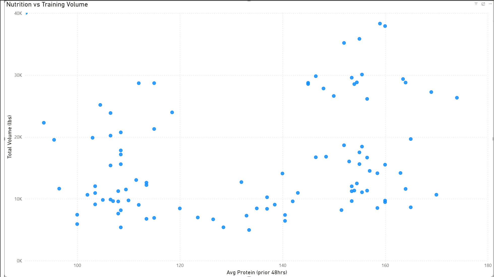
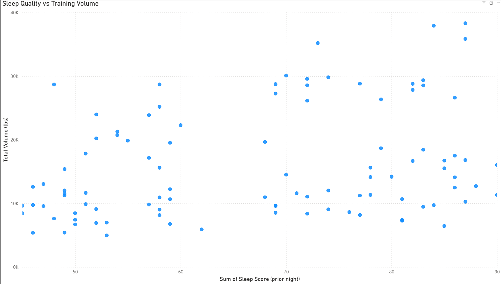
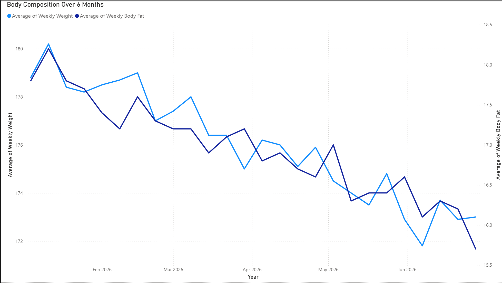
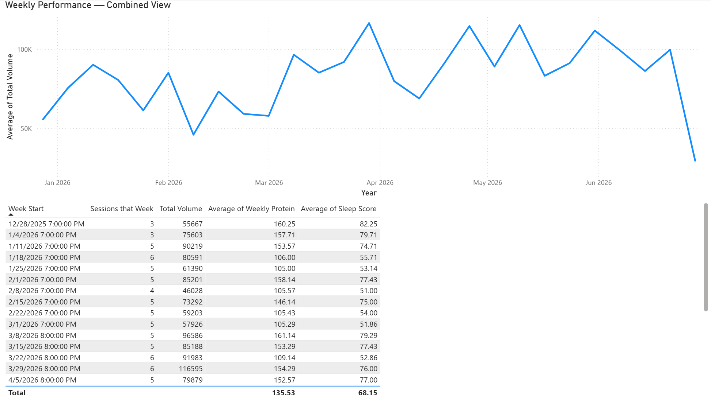

# Baseline Fitness Analytics

A end-to-end analytics pipeline exploring how sleep, nutrition, and training consistency 
interact to predict workout performance and body composition change over 6 months.

---

## The Question

**What combination of sleep quality, protein intake, and training frequency best predicts 
weekly training output and body composition improvement?**

Most fitness tracking apps collect this data but never connect it. This project builds the 
analytical layer that does — joining food logs, workout sessions, sleep scores, and body 
measurements to surface correlations that inform smarter training decisions.

---

## Dashboard

### Nutrition vs Training Volume

Sessions preceded by 150g+ daily protein averaged significantly higher volume than those 
preceded by sub-110g days.

### Sleep Quality vs Training Volume

Sleep scores above 75 consistently preceded higher output sessions. Scores below 60 
correlated with the lowest volume days in the dataset.

### Body Composition Over 6 Months

Consistent training frequency of 5-6 sessions per week produced steady body composition 
improvement — ~8 lbs lost and ~2% body fat reduction over 6 months.

### Weekly Performance — Combined View

High volume weeks share a consistent pattern: protein above 150g and sleep score above 75. 
Training frequency alone does not predict output when nutrition and recovery are compromised.

---

## Key Findings

1. **Nutrition is a leading indicator** — prior 48-hour protein intake shows a positive 
correlation with training volume. Hitting 150g+ protein consistently preceded the highest 
output sessions.

2. **Sleep quality compounds nutrition** — sleep score the night before a session amplifies 
or dampens the nutrition effect. Poor sleep on an otherwise well-fueled day still produced 
below-average output.

3. **Consistency drives composition** — weeks with 4+ sessions correlated with steady 
downward trends in both body weight and body fat percentage across the full 6-month window.

4. **The combined predictor** — no single variable fully explains performance variance. 
The strongest predictor of a high-volume week is high protein AND high sleep score together. 
Frequency is secondary when recovery is compromised.

---

## Methodology

### Data
This project uses synthetic data generated to model known physiological relationships between 
sleep, nutrition, and athletic performance. The dataset covers January–June 2026 and includes:

- 543 food entries across 181 days (3 meals/day)
- 135 workout sessions following a Push/Pull/Legs split
- 540 session exercise records with sets, reps, and weight
- 420 measurement entries (weight, body fat, sleep score, steps)

Correlations were intentionally designed to fall in the r=0.55–0.70 range with realistic 
noise — including bad weeks injected every 3-4 weeks to reflect real behavioral patterns. 
A perfect correlation would indicate fabricated data.

### Causal Model
The Python generation script encodes a volume multiplier that scales rep counts based on:
- Sleep score from the prior night (recovery effect)
- Average protein intake over the prior 48 hours (fuel effect)

This is what makes the correlations detectable by SQL — the signal is real within the 
dataset, not random noise.

### Stack
| Layer | Tool |
|---|---|
| Data Generation | Python, Supabase Python client |
| Database | Supabase (PostgreSQL) |
| Analysis | SQL (4 analytical queries) |
| Visualization | Power BI |

---

## Project Structure

```
baseline-fitness-analytics/
├── generate_synthetic_data.py   # Synthetic data generation script
├── sql/
│   ├── query1_nutrition_performance.sql
│   ├── query2_sleep_performance.sql
│   ├── query3_consistency_composition.sql
│   └── query4_combined_predictor.sql
├── images/                      # Dashboard screenshots
├── .env.example                 # Environment variable template
├── requirements.txt             # Python dependencies
└── README.md
```

## Setup

```bash
# Clone the repo
git clone https://github.com/Cervantes-Jose/baseline-fitness-analytics.git

# Create and activate virtual environment
python -m venv venv
venv\Scripts\activate        # Windows
source venv/bin/activate     # Mac

# Install dependencies
pip install -r requirements.txt

# Copy environment template and fill in your values
cp .env.example .env

# Run the data generation script
python generate_synthetic_data.py
```

---

*Data is synthetic and generated to model physiological relationships for analytical 
demonstration purposes.*